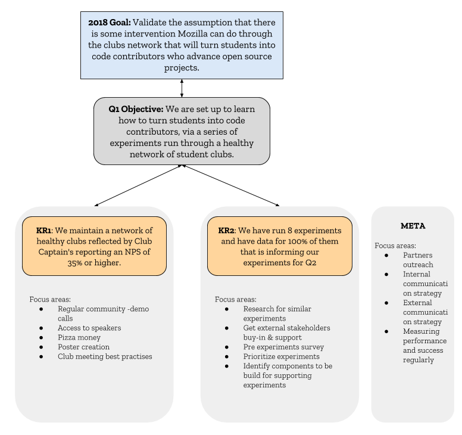

<h2> Mozilla Open Source Student Network Working Repo </h2>

We’re fueling the open movement by creating a network of clubs on university campuses in the United States who learn about and contribute to open source.   You can find more information about this program at http://opensource.mozilla.community

This repository serves as a project management tool for the development of the program.

<h3>Team Members</h3>

- Lucy Harris
- Christos Bacharakis
- Rina Tambo Jensen
- Arielle Kilroy
- Megan Branson
- Tasos Katsoulas

<h3> Project's goals for 2018 & Q1 </h3>
</img>
